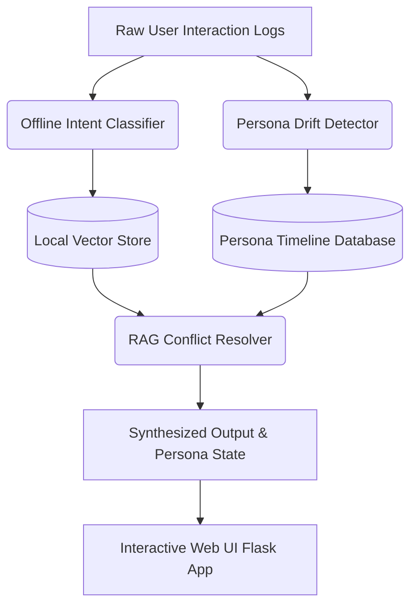

# Adaptive Persona Engine


The **Adaptive Persona Engine** is a privacy-first, locally deployable intelligence system designed to continuously track, analyze, and adapt to long-term shifts in a user's communication style, emotional state, and core context. By utilizing an offline-first architecture, the system guarantees sensitive interaction data remains securely on-device while providing sophisticated Retrieval-Augmented Generation (RAG) capabilities and intent classification.

---

## Table of Contents
1. [System Architecture Overview](#system-architecture-overview)
2. [Core Modules](#core-modules)
   - [Part 1: Persona Drift Detector](#part-1-persona-drift-detector)
   - [Part 2: Offline Intent Classifier](#part-2-offline-intent-classifier)
   - [Part 3: RAG Conflict Resolver](#part-3-rag-conflict-resolver)
   - [Part 4: Interactive Web UI](#part-4-interactive-web-ui)
3. [Installation & Setup](#installation--setup)
4. [Usage Guidelines](#usage-guidelines)
5. [Data Synchronization & Privacy](#data-synchronization--privacy)
6. [License](#license)

---

## System Architecture Overview

The system is composed of decoupled subsystems that handle data ingestion, semantic classification, and context synthesis, orchestrated by a local Web API.



---

## Core Modules

### Part 1: Persona Drift Detector
*(Location: `src/part1_drift_detector.py`)*

The Drift Detector is responsible for generating continuous temporal analytics of the user's emotional state. Rather than aggregating interactions into a static summary, it maps the evolution of the user's tone across disparate days.
*   **Drift Timeline:** Structurally models day-over-day changes (e.g., transitioning from a formal inquiry to casual frustration).
*   **Trigger Extraction:** Autonomously isolates the explicit events, topics, or mentioned entities that act as catalysts for the detected persona shift.

### Part 2: Offline Intent Classifier
*(Location: `src/part2_intent_classifier.py`)*

A meticulously optimized Natural Language Processing (NLP) pipeline built to run inference directly on the CPU without reliance on external APIs (such as OpenAI or Google Gemini).
*   **Ultra-Lightweight Storage footprint:** The serialized `joblib` model occupies `< 0.02 MB`.
*   **Sub-millisecond Latency:** Executes intent predictions in `~1.0ms - 2.5ms` per message.
*   **Classification Taxonomy:** Categorizes inbound context into strict operational domains: `reminder`, `emotional-support`, `action-item`, `small-talk`, or `unknown`.
*   **Architecture:** Leverages a custom tuned `TfidfVectorizer` paired with a `LogisticRegression` sequence.

### Part 3: RAG Conflict Resolver
*(Location: `src/part3_rag_resolver.py`)*

A specialized semantic handler designed to solve the "Hard Retrieval Problem" inherent in long-term memory systems, where historical data often contradicts recent realities.
*   **Heuristic Ranking:** Evaluates retrieved chunks based on a custom algorithm weighing **Recency** (temporal relevance) against **Emotional Weight** (the density/significance of the interaction).
*   **Contradiction Flagging:** Preemptively scans high-priority chunks to flag semantically opposed statements before passing context to the generation layer.
*   **Coherent Synthesis:** Merges conflicting vectors logically, ensuring the output respects the evolution of the user's circumstances rather than outputting schizophrenic context.

### Part 4: Interactive Web UI
*(Location: `web/app.py` & `web/templates/` & `web/static/`)*

A lightweight, premium web interface built with Flask and modern web design principles (Glassmorphism, animated gradients, responsive layout). It serves as the primary dashboard to interact with all three backend systems in real-time.
*   **API Endpoints:** Clean REST API bridging the Python backend (`/api/drift`, `/api/intent`, `/api/resolve`) to the frontend.
*   **Visual Prototyping:** Allows developers and stakeholders to easily inject test payloads and visualize the model's performance without relying purely on terminal outputs.

---

## Installation & Setup

### Prerequisites
*   Python 3.9 or higher is required.
*   It is highly recommended to use a virtual environment (`venv` or `conda`).

### Dependency Installation
Clone the repository and install the required packages required for the offline classifier and web server:

```bash
git clone https://github.com/your-org/Persona-Drift-Detector.git
cd Persona-Drift-Detector
pip install scikit-learn joblib numpy flask
```

---

## Usage Guidelines

The modules are designed to be imported into your larger application orchestrator, but can be executed independently for demonstration and validation.

### Launching the Web Interface (Recommended)
To run the interactive web interface, launch the Flask server:
```bash
python web/app.py
```
*Expected Output:* The server will start on `http://127.0.0.1:5000/`. Open this URL in your browser to interact with all modules visually.

### Validating the Drift Detector
```bash
python src/part1_drift_detector.py
```
*Expected Output:* An analytical breakdown of the synthetic historical log, highlighting shifts in sentiment and their corresponding trigger events.

### Validating the Offline Intent Classifier
Upon the first execution, the script will autonomously generate the synthetic dataset, train the `TfidfVectorizer` pipeline, serialize the model offline, and perform latency benchmarking.
```bash
python src/part2_intent_classifier.py
```

### Validating the RAG Conflict Resolver
```bash
python src/part3_rag_resolver.py
```
*Expected Output:* A demonstration of the resolver receiving contradictory database chunks, ranking them according to the Recency/Emotion matrix, and outputting the synthesized resolution.

---

## Data Synchronization & Privacy

This repository utilizes a strict "Local-First" methodology. Raw audio, telemetry, and specific interaction vectors never leave the device. For extensive details regarding the device-to-cloud synchronization strategies, Conflict-free Replicated Data Types (CRDTs), and End-to-End Encryption (E2EE) protocols utilized when bridging multiple devices, please consult the independent System Design documentation.

---

## License

This project is proprietary and confidential. Unauthorized copying, distribution, or adaptation of this file, via any medium, is strictly prohibited unless explicitly authorized.